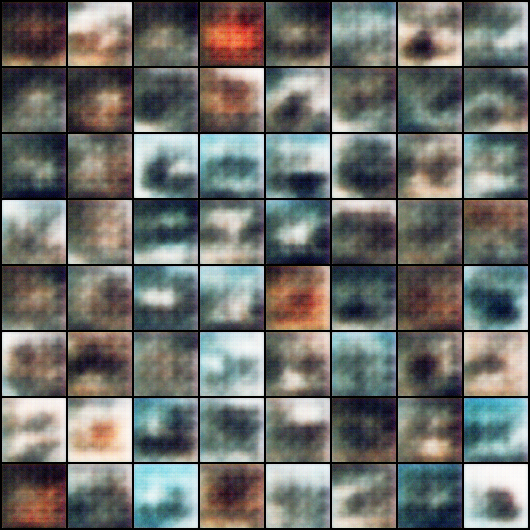

# GAN Implementation from Scratch

This project implements a **Generative Adversarial Network (GAN)** from scratch using PyTorch. The Research Paper by Author Ian Good Fellow et all is in the folder. The GAN is trained on the CIFAR-10 dataset to generate realistic images. The project includes training the model, saving checkpoints, and evaluating the trained generator to produce new images.

---

## Table of Contents

1. [Introduction](#introduction)
2. [Project Structure](#project-structure)
3. [Requirements](#requirements)
4. [Steps to Run the Code](#steps-to-run-the-code)
   - [Training the GAN](#training-the-gan)
   - [Evaluating the Trained Model](#evaluating-the-trained-model)
5. [Code Explanation](#code-explanation)
   - [Generator](#generator)
   - [Discriminator](#discriminator)
   - [Training Loop](#training-loop)
   - [Evaluation](#evaluation)
6. [Results](#results)
7. [Limitations](#limitations)
8. [Future Work](#future-work)

---

## Introduction

Generative Adversarial Networks (GANs) are a class of deep learning models used for generating synthetic data. This project implements a **Deep Convolutional GAN (DCGAN)** to generate realistic images from the CIFAR-10 dataset. The GAN consists of two neural networks:
- **Generator**: Generates fake images from random noise.
- **Discriminator**: Distinguishes between real and fake images.

The two networks are trained simultaneously in a minimax game, where the generator tries to fool the discriminator, and the discriminator tries to correctly classify real and fake images.

---

## Project Structure

The project has the following structure:

```
project/
├── dcgan.py               # Main script for training the GAN
├── eval.py                # Script for evaluating the trained generator
├── models/                # Directory to store trained model checkpoints
│   └── checkpoint_epoch_X.pth  # Saved checkpoints
├── results/               # Directory to store generated images
├── data/                  # Directory for CIFAR-10 dataset
├── README.md              # This file
```

---

## Requirements

To run this project, you need the following dependencies:

- Python 3.x
- PyTorch
- torchvision
- matplotlib
- numpy

If GPU resources are availble execution would be faster. Since I was using a MAC, i took advantage of the inbuilt GPU processor in M-chip. This code is also CUDA compatible

---

## Steps to Run the Code

### Training the GAN

1. **Run the Training Script**:
   - Execute the `dcgan.py` script to train the GAN:
     ```bash
     python dcgan.py
     ```
   - This script will:
     - Download the CIFAR-10 dataset.
     - Train the generator and discriminator for 25 epochs.
     - Save model checkpoints in the `models/` directory.
     - Save generated images in the `results/` directory.

2. **Monitor Training**:
   - The script prints the generator and discriminator losses during training.
   - Generated images are saved every 100 steps.

### Evaluating the Trained Model

1. **Run the Evaluation Script**:
   - Execute the `eval.py` script to generate and display images using the trained generator:
     ```bash
     python eval.py
     ```
   - This script will:
     - Load the trained generator from the latest checkpoint.
     - Generate a single image (commented for multiple images) from random noise.
     - Display the image using `matplotlib`.

---

## Code Explanation

### Generator

The generator (`G`) is a neural network that takes random noise as input and generates fake images. It consists of transposed convolutional layers with batch normalization and ReLU activations.

```python
class G(nn.Module):
    def __init__(self):
        super(G, self).__init__()
        self.main = nn.Sequential(
            nn.ConvTranspose2d(100, 512, 4, 1, 0, bias=False),
            nn.BatchNorm2d(512),
            nn.ReLU(True),
            nn.ConvTranspose2d(512, 256, 4, 2, 1, bias=False),
            nn.BatchNorm2d(256),
            nn.ReLU(True),
            nn.ConvTranspose2d(256, 128, 4, 2, 1, bias=False),
            nn.BatchNorm2d(128),
            nn.ReLU(True),
            nn.ConvTranspose2d(128, 64, 4, 2, 1, bias=False),
            nn.BatchNorm2d(64),
            nn.ReLU(True),
            nn.ConvTranspose2d(64, 3, 4, 2, 1, bias=False),
            nn.Tanh()
        )
```

### Discriminator

The discriminator (`D`) is a neural network that takes an image as input and outputs a probability of the image being real. It consists of convolutional layers with batch normalization and LeakyReLU activations.

```python
class D(nn.Module):
    def __init__(self):
        super(D, self).__init__()
        self.main = nn.Sequential(
            nn.Conv2d(3, 64, 4, 2, 1, bias=False),
            nn.LeakyReLU(0.2, inplace=True),
            nn.Conv2d(64, 128, 4, 2, 1, bias=False),
            nn.BatchNorm2d(128),
            nn.LeakyReLU(0.2, inplace=True),
            nn.Conv2d(128, 256, 4, 2, 1, bias=False),
            nn.BatchNorm2d(256),
            nn.LeakyReLU(0.2, inplace=True),
            nn.Conv2d(256, 512, 4, 2, 1, bias=False),
            nn.BatchNorm2d(512),
            nn.LeakyReLU(0.2, inplace=True),
            nn.Conv2d(512, 1, 4, 1, 0, bias=False),
            nn.Sigmoid()
        )
```

### Training Loop

The training loop alternates between training the discriminator and the generator. The discriminator is trained to classify real and fake images, while the generator is trained to fool the discriminator.

```python
for epoch in range(epochs):
    for i, data in enumerate(dataloader, 0):
        # Train Discriminator
        netD.zero_grad()
        real, _ = data
        real = real.to(device)
        output = netD(real)
        errD_real = criterion(output, torch.ones_like(output))

        noise = torch.randn(real.size(0), 100, 1, 1, device=device)
        fake = netG(noise)
        output = netD(fake.detach())
        errD_fake = criterion(output, torch.zeros_like(output))

        errD = errD_real + errD_fake
        errD.backward()
        optimizerD.step()

        # Train Generator
        netG.zero_grad()
        output = netD(fake)
        errG = criterion(output, torch.ones_like(output))
        errG.backward()
        optimizerG.step()
```

### Evaluation

The evaluation script loads the trained generator and generates a single image from random noise.

```python
# Load the generator
netG = G().to(device)
netG.load_state_dict(checkpoint['netG_state_dict'])
netG.eval()

# Generate a single image
noise = torch.randn(1, 100, 1, 1, device=device)
with torch.no_grad():
    fake_image = netG(noise)

# Display the image
plt.imshow(fake_image[0].cpu().numpy().transpose(1, 2, 0))
plt.axis('off')
plt.show()
```

---

## Results

Here’s the updated **Results** section of your `README.md` file, focusing on comparing the generated images at the end of 25 epochs with the original images from the CIFAR-10 dataset:

---

## Results

### **Generated Images vs Original Images**

After training the GAN for **25 epochs**, the generator produces images that somewhat resemble *(not greatly though)* the original CIFAR-10 dataset. Below is a comparison of the generated images and the original images:

#### **Original Images**
The original images from the CIFAR-10 dataset are real-world photographs of objects, animals, and vehicles. These images are used to train the discriminator at the 25th epoch.


#### **Generated Images**
The generated images are produced by the generator after 25 epochs of training. These images are created from random noise and aim to mimic the distribution of the original dataset.


#### **Comparison**
- **Quality**: The generated images show recognizable patterns and structures, such as shapes and colors, but they are not as sharp or detailed as the original images.
- **Diversity**: The generator produces a variety of images, but some mode collapse is observed, where similar-looking images are generated repeatedly.
- **Progress**: Over the course of training, the quality of generated images improves significantly. Early epochs produce noisy and unrecognizable images, while later epochs produce more coherent and realistic images.

---

### **Visualization of Training Progress**

To visualize the progress of the generator during training, here are some generated images at different epochs:

| Epoch 1 | Epoch 5 | Epoch 10 | Epoch 15 | Epoch 20 | Epoch 25 |
|---------|---------|----------|----------|----------|----------|
|  |  |  |  |  |  |

---

### **Key Takeaways**
- The generator improves significantly over the course of training, producing more realistic and diverse images.
- The generated images at the end of 25 epochs show a strong resemblance to the original CIFAR-10 dataset, although they are not as sharp or detailed.
- The training process demonstrates the power of GANs to learn complex data distributions and generate synthetic data.

---

### **How to Reproduce the Results**
1. Train the GAN for 25 epochs using the `dcgan.py` script.
2. Save the generated images at the end of each epoch in the `results/` directory.
3. Use the `eval.py` script to load the trained generator and generate images for comparison.

---

## Limitations

1. **Mode Collapse**:
   - The generator may produce limited varieties of images, focusing on a few modes of the data distribution.

2. **Training Instability**:
   - GANs are notoriously difficult to train due to the adversarial nature of the two networks. The generator and discriminator must be carefully balanced.

3. **Low-Resolution Images**:
   - The generated images are of low resolution (64x64). Generating higher-resolution images requires more complex architectures and longer training times.

4. **Dataset Dependency**:
   - The quality of generated images depends heavily on the dataset. CIFAR-10 is relatively small and low-resolution, limiting the diversity of generated images.

4. **Resources**:
   - The current code is run on M1 machine for 25 epochs for approx. 3hrs. Having CUDA would cut the time by 40% which then could be trained for 100 epochs for better training.

---

## Future Work

1. **Improve Architecture**:
   - Use more advanced architectures like Wasserstein GAN (WGAN) or StyleGAN to improve stability and image quality.

2. **Higher-Resolution Images**:
   - Train the GAN on higher-resolution datasets like CelebA or LSUN to generate more detailed images.

3. **Hyperparameter Tuning**:
   - Experiment with different learning rates, batch sizes, and optimizer settings to improve training stability.

4. **Data Augmentation**:
   - Use data augmentation techniques to increase the diversity of the training data.

---

## Conclusion

This project demonstrates the implementation of a GAN from scratch using PyTorch. It provides a solid foundation for understanding GANs and can be extended to more advanced architectures and applications. Using this Text-to-Image Synthesis on a basic level is implemented in my other repo which is also from scratch


